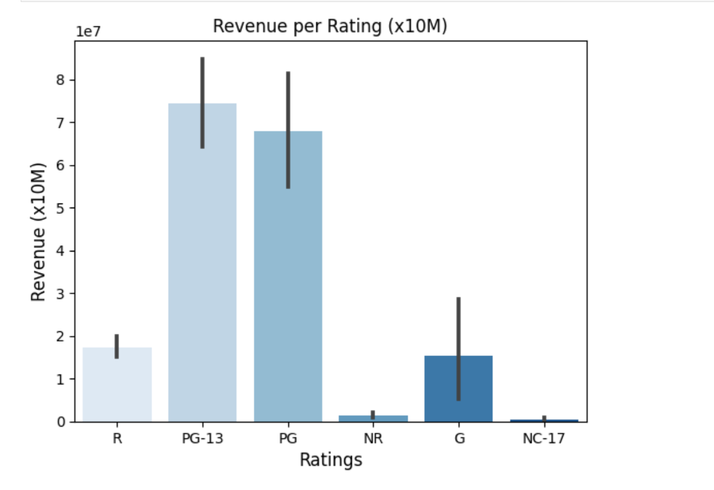

# IMDB analysis

By **Paula Pipkin** 

### Evaluating factors that are relevant for the revenue of a movie :

This dataset collects most relevant information for movies released between 2012 and 2021. 
The features cover information like budget, revenue, ratings, certification and so on.

### Data:

The inicial data was downloaded from https://datasets.imdbws.com/ and aditional information was gathered using API calls from IMDB.

## Methods

- SQL files were created using the ETL method.  
- Queries were made to extract the necessary data to respond to the stakeholders questions.
- Hypothesis test and vizualizations were done to better answer those question

## Results

### EDA

#### Revenue by certification rating: Does the MPAA rating of a movie (G/PG/PG-13/R) affect how much revenue the movie generates?

> Out of 835 patients, 1/3 or 33% of those patients diagnosed with HPV were also diagnosed with cervical cancer, only 5% of those without HPV were diagnosed with Cervical Cancer.

> "Virtually all cervical cancers are caused by HPV. Routine screening can prevent most cervical cancers by allowing health care providers to find and remove precancerous cells before they develop into cancer." (source: https://www.cancer.gov/about-cancer/causes-prevention/risk/infectious-agents#hpv).

#### Hormonal Contraceptives Use

> In our sample, 18% more women were diagnosed with Cervical Cancer among those patients using Hormonal Contraceptive for longer than 10 years.

> The longer a woman uses oral contraceptives, the greater the increase in her risk of cervical cancer. One study found a 10% increased risk for less than 5 years of use, a 60% increased risk with 5–9 years of use, and a doubling of the risk with 10 or more years of use (source: https://www.cancer.gov/about-cancer/causes-prevention/risk/hormones/oral-contraceptives-fact-sheet)

### Metrics

#### Scores and Confusion Matrix:

Accuracy 0.96

| Score        | Classe 0                   | Classe 1       |
| ------------- | -----------------------| -------- |
| Precision | 0.98	 | 0.69 |
| Recall |0.97             |0.79  |

## Recommendations, Limitations & Next Steps:

- For this case, a false posite and a false negative are very serious errors, a patient without cancer should not be subimitted to treatment, and a positive result can't go untreated.
- Having that in mind, I still believe that our model is useful, however I would suggest that a second measure would be used to confirm the results prior to treatment or dismissal of treatment.

### For further information

For any additional questions, please contact **paulareche@gmail.com**
