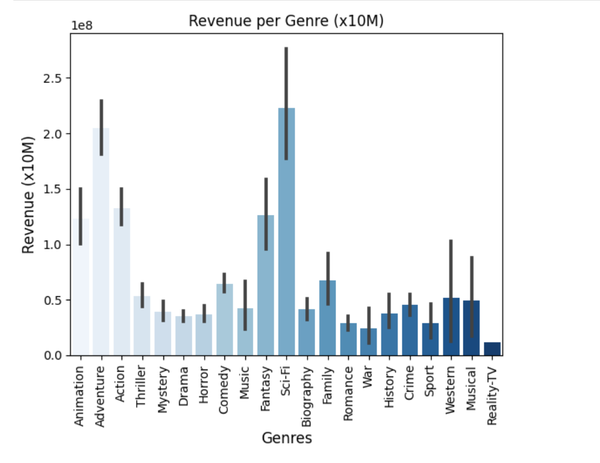
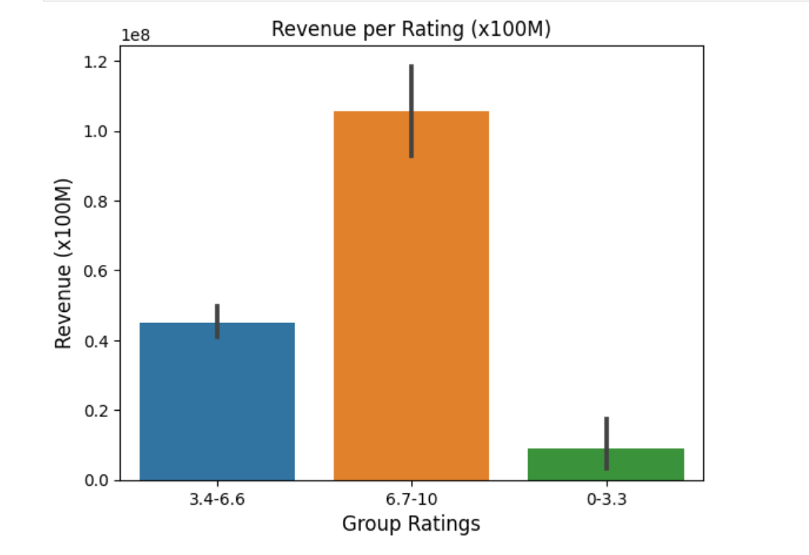

# IMDB analysis

By **Paula Pipkin** 

### Evaluating factors that are relevant for the revenue of a movie :

This dataset collects most relevant information for movies released between 2012 and 2021. 
The features cover information like budget, revenue, ratings, certification and so on.

### Data:

The inicial data was downloaded from https://datasets.imdbws.com/ and aditional information was gathered using API calls from IMDB.
This data has more de 35000 rows total.

## Methods

- SQL files were created using the ETL method.  
- Queries were made to extract the necessary data to respond to the stakeholders questions.
- Hypothesis test and vizualizations were done to better answer those question

## Results

### Hypothesis & EDA

#### Revenue by certification rating: Does the MPAA rating of a movie (G/PG/PG-13/R) affect how much revenue the movie generates?

> PG and PG13 movies are the ones with higher revenue

#### Revenue by genre: Does Genre affects revenue?

> In the last 10 years, Sci-Fi, Adventure and Fantasy are the top 3 genres for generating revenue in that order

#### Revenue by review/ratings: Does rating score affects revenue?

> Revenue is higher for movies with higher ratings!
> 
### Metrics

#### Scores :

## Recommendations, Limitations & Next Steps:

- A model will be applied to predict if a movie will be successful in generating revenue.
- To come

### For further information

For any additional questions, please contact **paulareche@gmail.com**
